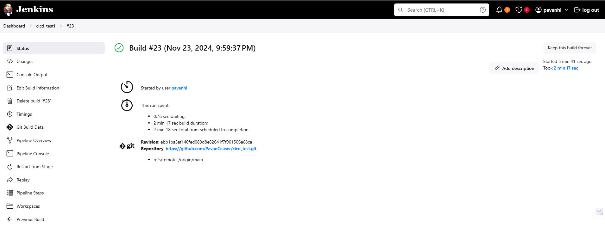
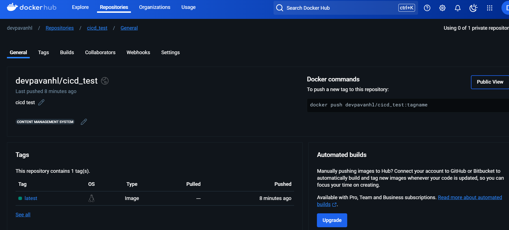
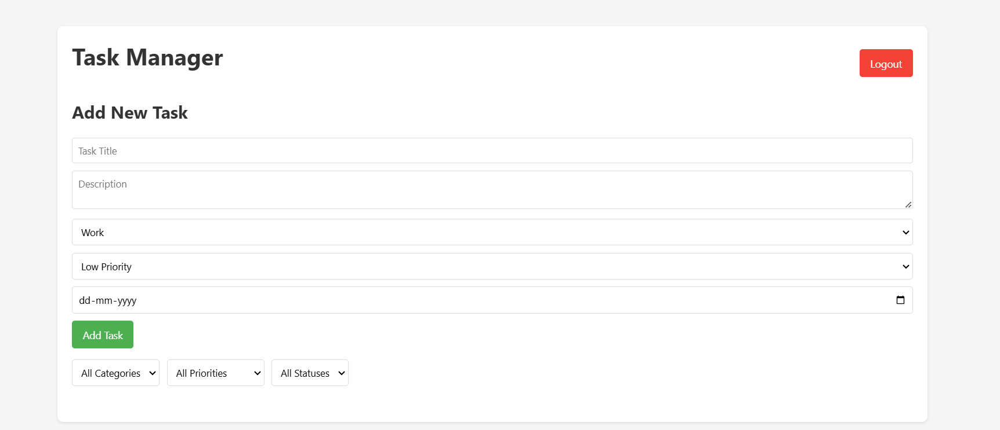
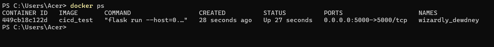
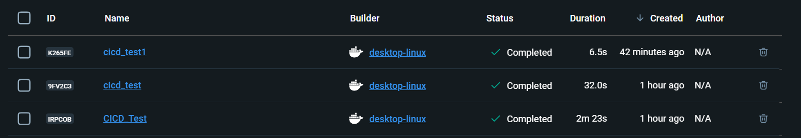

Flask Task Management Application

Overview  
This project is a simple Flask-based Task Management Application designed for managing tasks by using couchDb as database. It provides a user-friendly interface to create, update, delete, and view tasks. The application is containerized using Docker and automated with a CI/CD pipeline using Jenkins for streamlined development, testing, and deployment processes.


Features  
- Add, update, delete, and view tasks.  
- Lightweight and modular codebase.  
- Dockerized for easy deployment and scalability.  
- CI/CD pipeline for automated build, test, and deployment.  


Prerequisites  
- Python installed (version 3.6+ recommended).  
- Virtualenv installed for Python virtual environments.  
- Docker installed and running.  
- Jenkins installed and configured for CI/CD (optional but recommended).  

---

Setup Instructions  

1. Clone the Repository  
```
git clone https://github.com/PavanCeaser/CICD_Test.git
cd CICD_Test
```

2. Create a Virtual Environment  
```
virtualenv myenv
```

3. Activate the Virtual Environment  
- On Windows:  
  ```
  myenv\Scripts\activate
  ```
- On Linux/Mac:  
  ```
  source myenv/bin/activate
  ```

4. Install Dependencies  
```
pip install -r requirements.txt
```

5. Run the Application  
```
python app.py
```
The application will run on `http://localhost:5000` by default.

---

Docker Instructions  

1. Build the Docker Image  
```
docker build -t cicd_test .
```

2. Run the Docker Container  
```
docker run -p 5000:5000 cicd_test
```
The application will be accessible at `http://localhost:5000`.

---

Jenkins CI/CD Pipeline  

Pipeline Workflow  
1. Clone Repository: Jenkins fetches the latest code from the GitHub repository.  
2. Build Docker Image: Jenkins builds a Docker image for the Flask application.  
3. Push Docker Image: Jenkins pushes the Docker image to Docker Hub.  
4. Deploy: The application container is deployed using the Docker image.

Triggering the Pipeline  
- The Jenkins pipeline is triggered automatically whenever a new commit is pushed to the GitHub repository.

---

Docker Hub  
- The Docker image is hosted on Docker Hub and can be pulled using the following command:  
  ```
  docker pull devpavanhl/cicd_test:latest
  '''
  

# Running the Application with Docker Compose
Build and Start the Container

'''
docker-compose up --build
'''
Stop the Application

'''
$ docker-compose down
'''
Rebuild Without Cache (if needed)

'''
$ docker-compose build --no-cache
'''
Access the Application
Visit http://localhost:5000 in your browser.
---

Screenshots  

Jenkins Build Success  


Docker Hub Image  


Project output


On Docker


Docker Desktop

---

Technologies Used  
- Flask: Backend framework for creating the web application.  
- Docker: Containerization for consistent and scalable deployment.  
- Jenkins: CI/CD pipeline automation.  
- GitHub: Version control and code hosting.  
- Docker Hub: Docker image hosting and registry.


How to Contribute  
1. Fork the repository.  
2. Create a new branch (`git checkout -b feature-branch`).  
3. Make your changes and commit them (`git commit -m "Description"`).  
4. Push to the branch (`git push origin feature-branch`).  
5. Open a Pull Request.

